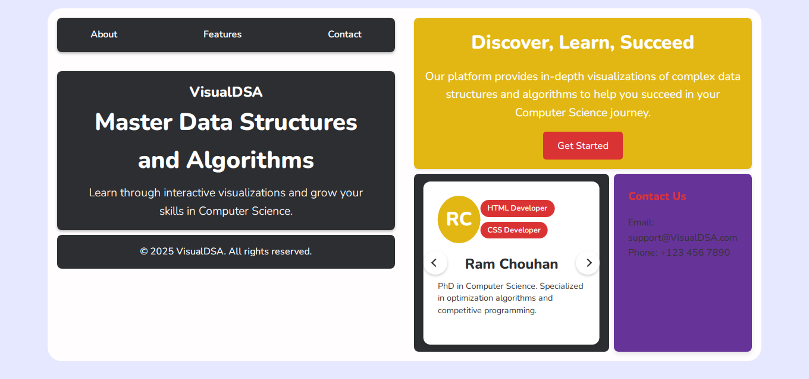
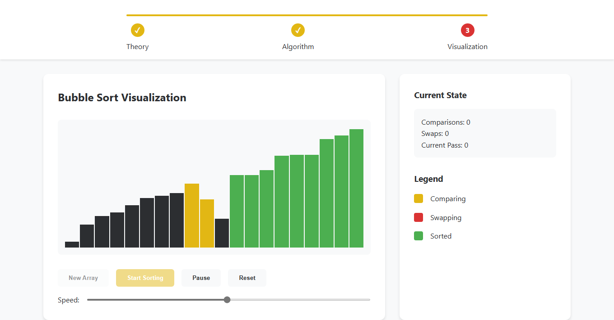

# VisualDS

VisualDS is an interactive and visually engaging platform designed to help users understand and explore data structures through visual representations. The project aims to simplify the learning process for data structures by providing clear and dynamic visualizations.

---

## Features

- **Interactive Visualizations**: Explore popular data structures like arrays, linked lists, trees, and graphs with intuitive controls.
- **Dynamic Updates**: Observe how operations like insertion, deletion, and traversal affect the structure.
- **Educational Focus**: Clear explanations accompany each visualization to enhance understanding.

---

## Installation

Follow these steps to set up and run the project locally:

1. **Clone the Repository**
   ```bash
   git clone https://github.com/SageGallant/VisualDS.git
   cd VisualDS
   ```

2. **Install Dependencies**
   Ensure you have [Node.js](https://nodejs.org/) installed. Then run:
   ```bash
   npm install
   ```

3. **Run the Project**
   Start the development server:
   ```bash
   npm start
   ```
   Open your browser and navigate to `http://localhost:3000` to view the application.

---

## Usage

1. Navigate to the homepage.
2. Select a data structure from the menu.
3. Use the provided controls to perform operations and see real-time updates to the visualization.

---

## Contributing

Contributions are welcome! To get started:

1. Fork the repository.
2. Create a new branch for your feature or bugfix:
   ```bash
   git checkout -b feature-name
   ```
3. Commit your changes and push to your fork:
   ```bash
   git commit -m "Add feature-name"
   git push origin feature-name
   ```
4. Open a pull request with a detailed description of your changes.

---

## License

This project is licensed under the MIT License. See the [LICENSE](LICENSE) file for details.

---

## Acknowledgments

- Inspired by the need for better educational tools for learning data structures.
- Special thanks to the open-source community for their support and contributions.

---

## Screenshots

Here are some screenshots of the application:

1. **Homepage**
   

2. **Array Visualization**
   

---

## Feedback

If you have any feedback, please reach out via [GitHub Issues](https://github.com/SageGallant/VisualDS/issues).
